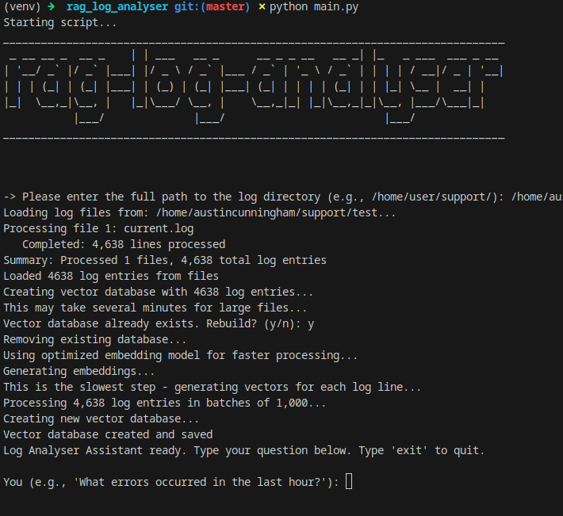

# RAG Log Analyser
**[WARNING]: This tool is a POC and is very slow to create the vector DB**

Transform log files into an intelligent, queryable knowledge base using Retrieval-Augmented Generation (RAG). Ask questions in plain English and get intelligent insights from your logs.

## Prerequisites

### Install Ollama (for local LLM)
```bash
# Install Ollama
curl -fsSL https://ollama.ai/install.sh | sh

# Pull the Mistral model
ollama pull mistral
```

### Python Dependencies
```bash
pip install -r requirements.txt
```

## Quick Start

1. **Clone the repository**
```bash
git clone https://github.com/austincunningham/rag_log_analyser
cd rag_log_analyser
```

2. **Install dependencies**
```bash
pip install -r requirements.txt
```

3. **Run the analyser**
```bash
python main.py
```



## Architecture

### Project Structure
```
📁 rag_log_analyser/
├── main.py                    # Main RAG application
├── utils/
│   └── loaders.py            # Custom log file processor
└── requirements.txt          # Python dependencies
```


## License

This project is licensed under the MIT License - see the [LICENSE](LICENSE) file for details.


