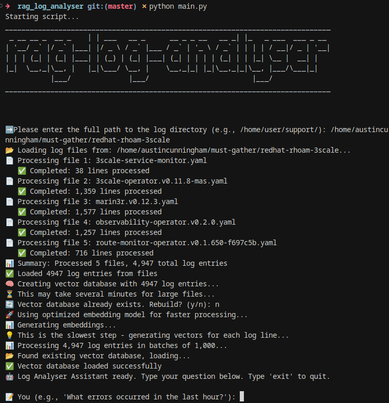

# RAG Log Analyser
**[WARNING]: This tool is a POC and is very slow to create the vector DB**
Transform your massive log files into an intelligent, queryable knowledge base using Retrieval-Augmented Generation (RAG). Ask questions in plain English and get intelligent insights from your logs.

## 🚀 Features

- **Natural Language Queries**: Ask questions like "What errors occurred in the last hour?"
- **Line-by-Line Processing**: Each log entry becomes a searchable document
- **Source Attribution**: Always know which file and line number provided the information
- **Multiple Format Support**: Works with `.log`, `.txt`, `.out`, `.err`, `.access`, `.csv`, `.json`, `.yaml`, `.yml`, `.md`, `.asciidoc`
- **Progress Tracking**: Real-time processing updates for large files
- **Local Processing**: No data leaves your machine - complete privacy

## 🎯 Use Cases

- **Incident Response**: "What caused the system outage at 3 PM?"
- **Performance Monitoring**: "Are there any slow database queries?"
- **Security Analysis**: "Find all failed login attempts"
- **Error Tracking**: "Show me all authentication failures"
- **Pattern Detection**: "What happened around 2:30 PM?"

## 📋 Prerequisites

### Install Ollama (for local LLM)
```bash
# Install Ollama
curl -fsSL https://ollama.ai/install.sh | sh

# Pull the Mistral model
ollama pull mistral
```

### Python Dependencies
```bash
pip install -r requirements.txt
```

## 🚀 Quick Start

1. **Clone the repository**
```bash
git clone <your-repo-url>
cd rag_log_analyser
```

2. **Install dependencies**
```bash
pip install -r requirements.txt
```

3. **Run the analyser**
```bash
python main.py
```



## 🏗️ Architecture

### Project Structure
```
📁 rag_log_analyser/
├── main.py                    # Main RAG application
├── utils/
│   └── loaders.py            # Custom log file processor
├── images/
│   └── rag_log_analyser.png  # Demo screenshot
├── chroma_db/                # Persistent vector database
├── requirements.txt          # Python dependencies
├── README.md                 # Project documentation
└── LICENSE                   # MIT License
```

### System Architecture


### RAG Pipeline Flow

#### **1. Document Ingestion**
- **Input**: Raw log files (`.log`, `.txt`, `.out`, `.err`, etc.)
- **Processing**: Line-by-line parsing with metadata preservation
- **Output**: Individual document objects with source tracking

#### **2. Vector Embedding**
- **Model**: `sentence-transformers/all-MiniLM-L6-v2`
- **Process**: Convert text to 384-dimensional vectors
- **Optimisation**: Batch processing for efficiency

#### **3. Vector Storage**
- **Database**: ChromaDB with persistent storage
- **Indexing**: HNSW algorithm for fast similarity search
- **Persistence**: `./chroma_db/` directory for reuse

#### **4. Query Processing**
- **Retrieval**: Semantic similarity search
- **Context**: Top 4-6 most relevant log entries
- **Generation**: Mistral LLM analysis and summarisation

### Key Components

#### **Custom Log Loader** (`utils/loaders.py`)
- **Line-by-line processing**: Each log entry becomes a searchable document
- **Metadata preservation**: Source file and line number tracking
- **Progress tracking**: Real-time updates for large files
- **Format support**: Multiple log file extensions

#### **RAG Pipeline** (`main.py`)
- **Embedding generation**: HuggingFace sentence transformers
- **Vector storage**: ChromaDB with persistence
- **Query processing**: Semantic search + LLM generation
- **Interactive interface**: Continuous chat loop

#### **Vector Database** (`chroma_db/`)
- **Persistent storage**: Reusable between sessions
- **Fast retrieval**: HNSW indexing for similarity search
- **Metadata preservation**: Source attribution and traceability

## 🔧 Configuration

### Embedding Models
The system uses optimised settings by default:
- **Model**: `sentence-transformers/all-MiniLM-L6-v2`
- **Batch Size**: 32 (optimised for speed)
- **Device**: CPU (consistent performance)

### LLM Models
- **Default**: Mistral (via Ollama)
- **Alternative**: Llama2, CodeLlama, or any Ollama model

## 📊 Performance

### Processing Times (Approximate)
- **Small files** (< 1MB): 1-2 minutes
- **Medium files** (1-10MB): 5-10 minutes  
- **Large files** (10-50MB): 15-30 minutes
- **Very large files** (50MB+): 30+ minutes


## 📄 License

This project is licensed under the MIT License - see the [LICENSE](LICENSE) file for details.


